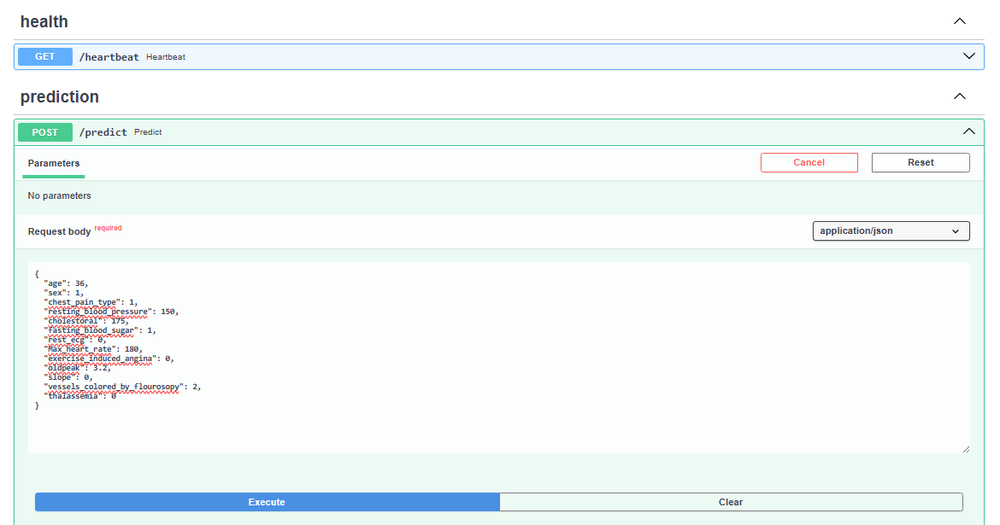
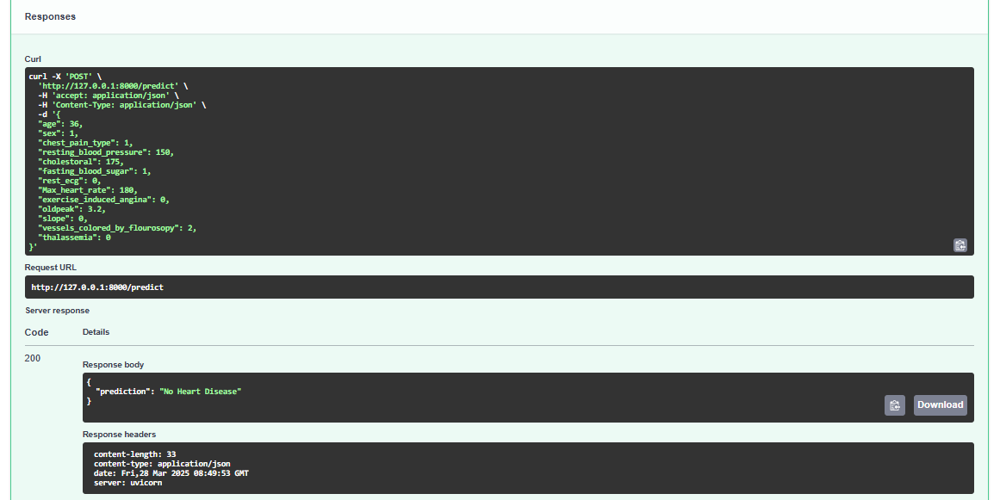

# Heart-Disease-Prediction 🩺❤️

World Health Organization has estimated 12 million deaths occur worldwide, every year due to Heart diseases. Half the deaths in the United States and other developed countries are due to cardio vascular diseases. The early prognosis of cardiovascular diseases can aid in making decisions on lifestyle changes in high risk patients and in turn reduce the complications.

This is a **FastAPI-based API** for predicting the likelihood of heart disease using a pre-trained **K-Nearest Neighbors (KNN) machine learning model**.  

## Dataset Description

I have used HeartDiseaseTrain-Test.csv

This is a multivariate type of dataset which means providing or involving a variety of separate mathematical or statistical variables, multivariate numerical data analysis. It is composed of 14 attributes which are age, sex, chest pain type, resting blood pressure, serum cholesterol, fasting blood sugar, resting electrocardiographic results, maximum heart rate achieved, exercise-induced angina, oldpeak - ST depression induced by exercise relative to rest, the slope of the peak exercise ST segment, number of major vessels and Thalassemia. This database includes 76 attributes, but all published studies relate to the use of a subset of 14 of them. The Cleveland database is the only one used by ML researchers to date. One of the major tasks on this dataset is to predict based on the given attributes of a patient that whether that particular person has heart disease or not and other is the experimental task to diagnose and find out various insights from this dataset which could help in understanding the problem more.

**Data Dictionary**

**age:** Age in years </br>
**sex:** male : 1 female : 0 </br>
**chest_pain_type:**

- Value 1: typical angina
- Value 2: atypical angina
- Value 3: non-anginal pain
- Value 4: asymptomatic

**resting_blood_pressure:** (in mm Hg on admission to the hospital) </br>
**cholestoral:** serum cholestoral in mg/dl </br>
**fasting_blood_sugar:** (fasting blood sugar > 120 mg/dl) (1 = true; 0 = false) </br>
**rest_ecg:** resting electrocardiographic results

- Value 0: normal
- Value 1: having ST-T wave abnormality (T wave inversions and/or ST elevation or depression of > 0.05 mV)
- Value 2: showing probable or definite left ventricular hypertrophy by Estes' criteria

**Max_heart_rate:** thalach - maximum heart rate achieved </br>
**exercise_induced_angina:** (1 = yes; 0 = no) Angina is chest pain or discomfort caused when your heart muscle doesn't get enough oxygen-rich blood. It may feel like pressure or squeezing in your chest. </br>
**oldpeak:** ST depression induced by exercise relative to rest </br>
**slope:** the slope of the peak exercise ST segment

- Value 1: upsloping
- Value 2: flat
- Value 3: downsloping

**vessels_colored_by_flourosopy:** number of major vessels (0-3) colored by flourosopy </br>
**thalassemia:** A blood disorder called thalassemia (3 = normal; 6 = fixed defect; 7 = reversable defect) </br>
**target:** 0 No Heart disease 1 Heart disease

## 📁 Folder Structure  

```plaintext
├── LICENSE                           # License file (MIT Recommended)
├── README.md                         # Documentation
├── docs
│   ├── DOCS.md                       # API Documentation
│   ├── sample_payload.json           # Sample Payload for Testing
│   ├── sample_payload_post.png       # Sample Input Screenshot
│   ├── sample_payload_response.png   # Sample Response Screenshot
├── fastapi_skeleton                  # Main API module
│   ├── __init__.py
│   ├── api                           # API routes
│   │   ├── __init__.py
│   │   └── routes
│   │       ├── __init__.py
│   │       ├── heartbeat.py          # Server health check
│   │       ├── prediction.py         # Prediction endpoint
│   │       └── router.py             # Main router
│   ├── core
│   │   ├── __init__.py
│   │   ├── config.py                 # Server configuration
│   │   ├── event_handlers.py         # Start/Stop event handlers
│   │   ├── messages.py               # Common messages
│   │   └── security.py               # API key validation
│   ├── main.py                       # Application entry point
│   ├── models
│   │   ├── __init__.py
│   │   ├── heartbeat.py              # Data model for heartbeat
│   │   ├── payload.py                # Data model for input
│   │   └── prediction.py             # Data model for predictions
│   └── services
│       ├── __init__.py
│       └── model_service.py          # ML model loading & inference
├── requirements.txt                  # Dependencies
├── sample_model
│   ├── lin_reg_california_housing_model.joblib # Sample ML model
│   └── model_description.md          # Model details
├── setup.py                          # Python setup script
├── tests
│   ├── __init__.py
│   ├── conftest.py                   # Test setup
│   ├── test_api
│   │   ├── __init__.py 
│   │   ├── test_heartbeat.py         # Health check tests
│   │   └── test_prediction.py        # ML prediction tests
│   └── test_service
│       ├── __init__.py       
│       └── test_model_service.py     # Model validation tests
├── tox.ini                           # Tox test configuration
└── .env                              # Environment variables (API keys, database URLs, secrets)

```

## Run It

1. Start your  app with:

```
uvicorn fastapi_skeleton.main:app
```

2. Go to [http://localhost:8000/docs](http://localhost:8000/docs).

3. You can use the sample payload from the `docs/sample_payload.json` file when trying out the heart disease prediction model using the API. 

Response



4. To view API documentation:

- Swagger UI: `http://127.0.0.1:8000/docs`

- Redoc UI: `http://127.0.0.1:8000/redoc`


## 📜 License

This project is licensed under the MIT License.
See the LICENSE file for details.
